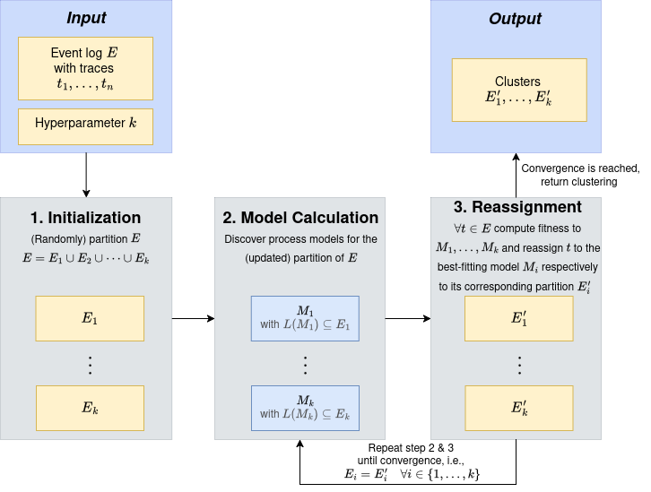

# k-traceoids

## Overview

**k-traceoids** is a structure-preserving trace clustering framework designed for event log analysis inspired by k-means.
By operating directly on trace data rather than vectorized representations, **k-traceoids** maintains the sequence of activities.

This framework was proposed in our [research paper](#) (link to be added). It addresses the shortcomings of traditional clustering techniques that transform traces into vectors, often losing essential sequencing information by treating them as unordered sets of events.

k-traceoids identifies meaningful clusters by capturing the structure of traces, grouping those that vectorial approaches typically miss due to their inability to preserve activity order.

## How It Works




1. **Initialization**

   * Input: an event log containing `n` traces, each with a unique case identifier.
   * Define the number of clusters `k` and the maximum number of iterations.
   * Each trace is randomly assigned to one of the `k` clusters.

2. **Model Calculation**

   * For each cluster, a representative model (centroid) is computed from the current trace assignments.
   * This model can be a process model, most frequent variant, or super variant.

3. **Trace Reassignment**

   * Each trace is evaluated for conformance against the cluster models.
   * Traces are reassigned to the cluster with the best-fitting model.

Steps 2 and 3 are repeated until convergence:

* No change in cluster assignments between iterations, or
* Maximum number of iterations is reached.

At convergence, the final process models and cluster assignments are produced.


## Installation and Setup

1. Clone this repository

```bash
git clone git@github.com:NeroCorleone/k-traceoids.git
cd k-traceoids
```

2. Install poetry

Follow the [official installation guide](https://python-poetry.org/docs/)

3. Install dependencies

```bash
poetry install
```

This will create a virtual environment, install all dependencies listed in pyproject.toml and install this package in editable mode.

## Usage

1. Activate the virtual environment

```bash
eval $(poetry env activate)
```

2. Cluster traces on a test dataset

Example usage: set hyperparameters (`k`, `max_iterations`, etc.) in `script.py`.

```python
python script.py
```
